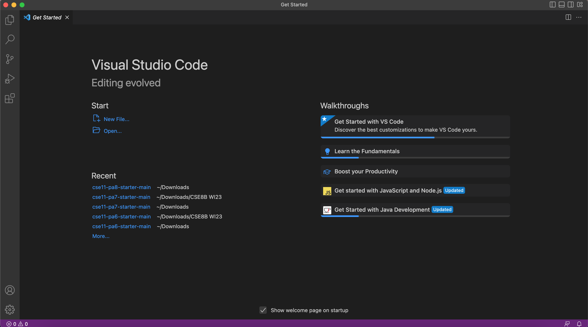

# Lab Report 1  

### Tutorial : How to log-in to a course specific account on ieng6!  

## Installing VS Code  
The first step is to download Visual Studio Code. You can dowload it by going to their website linked [here](https://code.visualstudio.com/) and your window should like the one seen below. Click download and follow the download instructions for your designated device.   

  

Once installed, open up VS Code and you should get a window similar to the one below. If you do, you have sucessfully installed the application!  
   

## Remotely Connecting  
To remotely connect on your device follow the steps below:  
1. Head to the following link to find your account for CSE15L. ([https://sdacs.ucsd.edu/~icc/index.php](https://sdacs.ucsd.edu/~icc/index.php))   
A website like the one shown below should appear. 
 
2. Once there, use "Account Lookup" where you will be prompted to enter your username (ie. the beginning of your ucsd email) and your student ID.
3. A page entitled "Account Lookup Results" should load and under the section "Additional Accounts" navigate to your account for CSE15L. It should 
begin with "cse15l" followed by the quarter you are taking the course (ex. sp23). 
4. Click on it, and copy down the username it gives you. It should be the same as the heading that navigated you to that page. 
5. Afterwards, on the same page, click on where it says "Global Password Change Tool". In the page that opens up, navigate and click on "Proceed to the Password Change Tool" and follow their given instructions. 
6. Once your passowrd is reset, it's time to open VS Code and create a new terminal. In this terminal you want to enter `ssh username@ieng6.ucsd.edu`. Of course, substituting username with the one you copied from Account Lookup.
6. As it's your first time connecting, you will find the terminal printing a message like this:   `Are you sure you want to continue connecting (yes/no/[fingerprint])?`
7. Type `yes` and you will then be asked to enter your password (the one you set when using the Global Password Change Tool).
8. Finally, you should be greeted with a message similar to "Hello some_username, you are currently logged into ieng6..." 
 

You are now remotely connected to a computer in the CSE basement! 

## Trying Out Commands! 
After remotely connecting, we can now run certain commands in our terminal. These following commands were given in lab:  
* `cd ~`
* `cd`
* `ls -lat`
* `ls -a`
* `ls <directory>`
* `cp /home/linux/ieng6/cs15lsp23/public/hello.txt ~/`
* `cat /home/linux/ieng6/cs15lsp23/public/hello.txt`
 
Here are my personal results after trying a few of the commands out:
 
 

 
I worked with a partner in lab and I highly reccommend comparing your command outputs with each other to ensure that you are using them correctly or 
resolve any issues you may find. After working on commands together, you can use either "ctrl + D" or run the command`exit`to log out of the remoter server in the terminal! ʕ•́ᴥ•̀ʔっ

