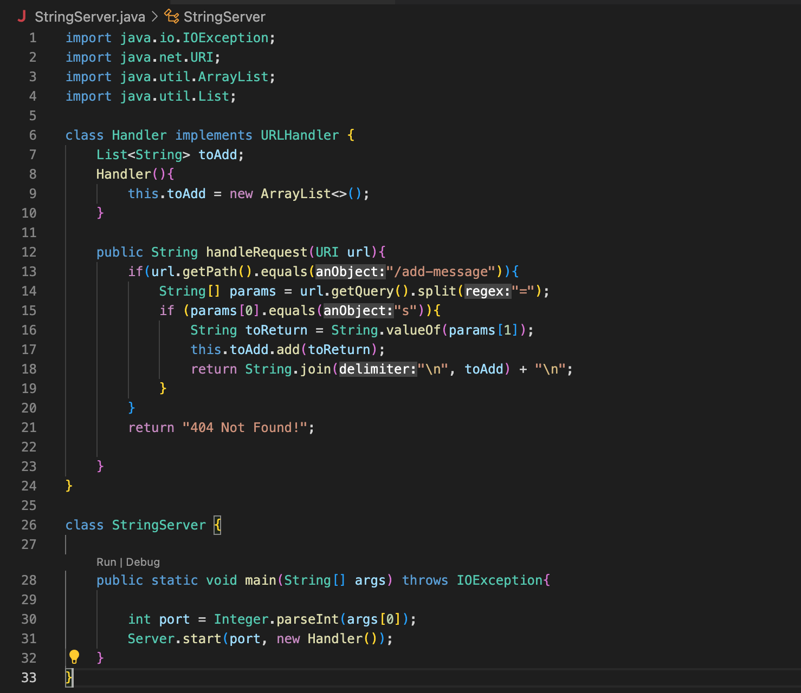
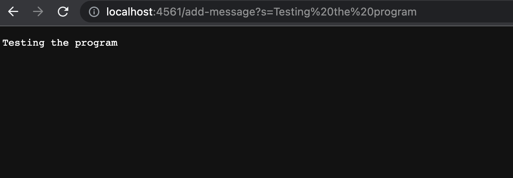
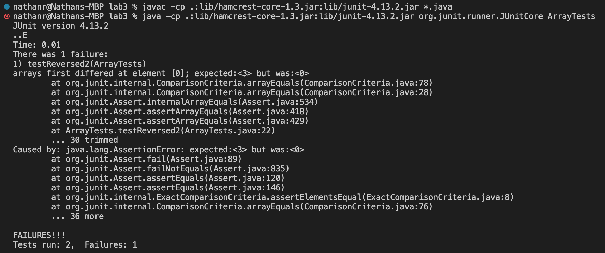

# Lab Report 2 <br>

### Part 1  <br>
**String Server Code** <br> <br>
<br>
---
**Examples of using add-message** <br> <br>

<br>

When using `add-message` in the url, it gets passed to the handleRequest method which checks for the appropritae syntax of the query and then takes the string after `s=` and sets it to the variable "toReturn". That same string is added in to the arraylist "toAdd" and then the updated contents of "toAdd" are returned--being what you see in the image above. <br>

<br>

In this use of `add-message`, it too employs the handleRequest method and takes the string query after `s=` and sets it to the variable "toReturn". That string is then added into the arraylist "toAdd" and then the contents of "toAdd" are returned which now include the present and previous query. <br>

---

### Part 2 <br>

**Non-Failure Inducing Input**
```
@Test
  public void testReversed() {
    int[] input1 = { };
    assertArrayEquals(new int[]{ }, ArrayExamples.reversed(input1));
  }
```
<br>

**Failure Inducing Input**
```
@Test
  public void testReversed2() {
    int[] input1 = {1, 2, 3};
    assertArrayEquals(new int[]{3, 2, 1}, ArrayExamples.reversed(input1));
  }
```
<br>

**Symptom** <br>
<br><br>

**Bug** <br>
Before: 
```
static int[] reversed(int[] arr) {
    int[] newArray = new int[arr.length];
    for(int i = 0; i < arr.length; i += 1) {
      arr[i] = newArray[arr.length - i - 1];
    }
    return arr;
  }
```
<br>
After: <br><br>

```
static int[] reversed(int[] arr) {
    int[] copy = new int[arr.length];
    for(int i = 0; i<arr.length; i += 1){
      copy[i] = arr[i];
    }
    int[] newArray = new int[arr.length];
    for(int i = 0; i < arr.length; i += 1) {
      newArray[i] = copy[arr.length - i - 1];
    }
    return newArray;
  }
```

<br>
This addresses the issue because the initial intention of the code was to return a new array whereas the code previously was returning the original array. Moreover, the previous code's attempt to reverse the elements of "arr" into "newArray" were actually setting the value of "arr" at index "i" to the elements of the empty "newArray"--producing zeroes at every index. Thus, the revision I implemented ensured that the elements of arr were actually being passed to "newArray".

<br>

## Part 3 <br>  ٩(˘◡˘)۶

The labs in weeks two and three have taught me how to run a server locally through the terminal as well as how to recieve queries through the server url. Additionally, they taught me how to remedy symptoms and bugs of a program using JUnit testing. 
