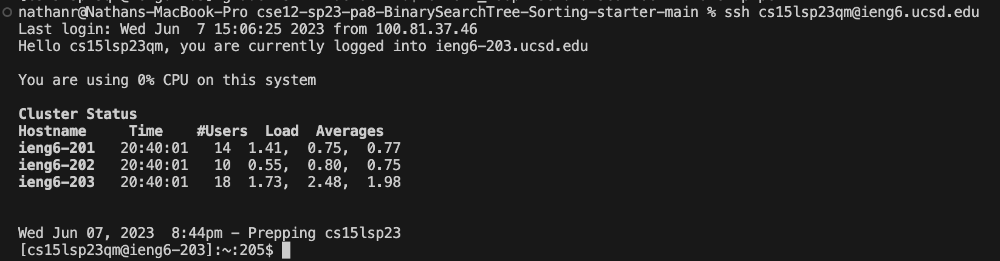
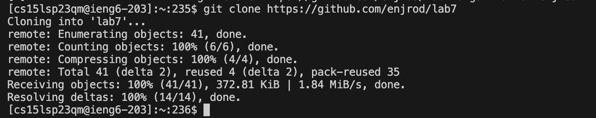
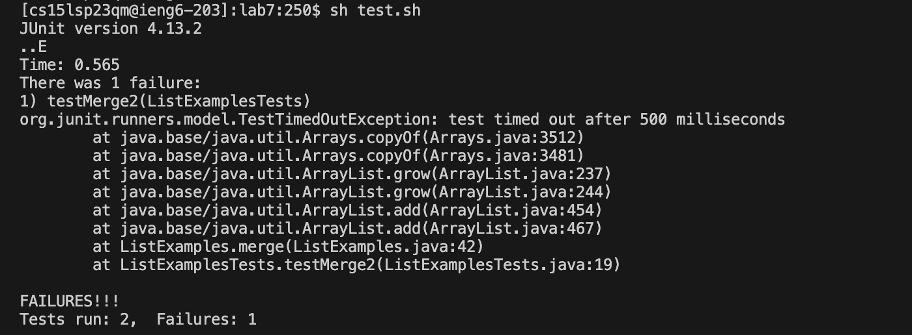
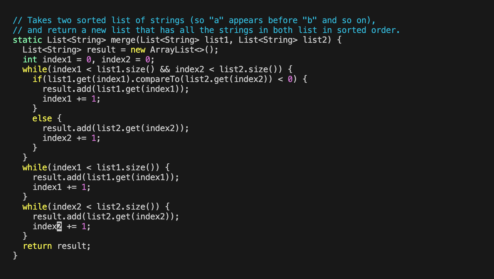
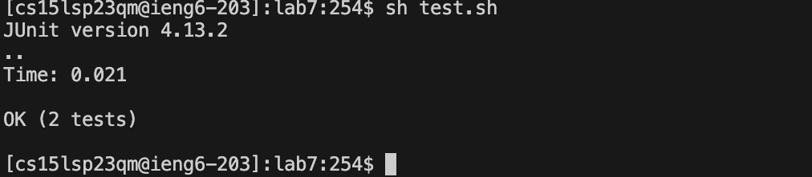
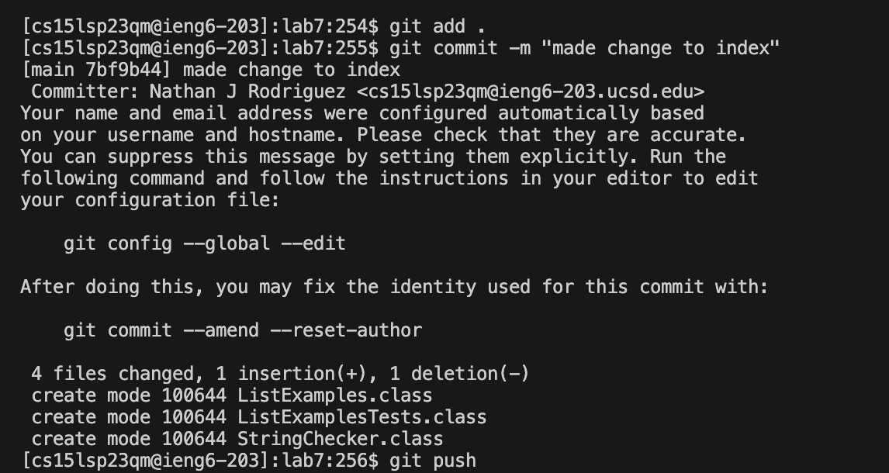

# Lab Report 4  
## ʕっ•ᴥ•ʔっ Lab Tasks: Steps 4-9  
  

**Step 4 : Log into ieng6**  

  

Keystrokes: `<up> <enter>`  

I had recently logged into my ieng6 account and it was one up in my command history.  

 

**Step 5 : Clone the fork**  

  

Keystrokes: `<forked the repo> <ctrl+c> <git clone> <ctrl+v> <enter>`  

First, I forked the lab7 repo from github. Then, I copied down the url of the forked repo onto my clipboard. I went back to my terminal and used git clone, along with pasting in the url and hit enter. 

 

**Step 6 : Run the tests**  

  

Keystrokes: `<cd lab7> <enter> <sh test.sh> <enter>`  

I changed directories into the lab7 directory. Then, I ran the tester by compiling the bash script. 

 

**Step 7 : Edit the code file to fix failing test**  

  

Keystrokes: `<vim ListExamples.java> <enter> </index1> <enter> <n> <n> <n> <n> <n> <i> <right> <right> <right> <right> <right> <backspace> <2> <esc> <:wq>`  

I used vim to access the ListExamples.java file. Then, I entered "/index1" and hit "n" until I got to the write index1. After, I entered insert mode, moved to the correct position using arrowkeys, and deleted the one--replacing with a two. Finally, I used escape to exit insert mode and saved. 

 

**Step 8 : Successfully run the tests**  

  

Keystrokes: `<up> <up> <enter>`  

Once I was out of vim, I used the arrow keys to find "sh test.sh" that I ran earlier in my command history and hit enter.
 

**Step 9 : Commit and push to Github account**  

  

Keystrokes: `<git add .> <enter> <git commit -m "changed index1 to index2"> <enter> <git push> <enter>`  

I used the above commands to commit and push the edits I made to my fork of the lab7 repository. 

 

**YAY IT'S DONE (〜^∇^)〜**

                

