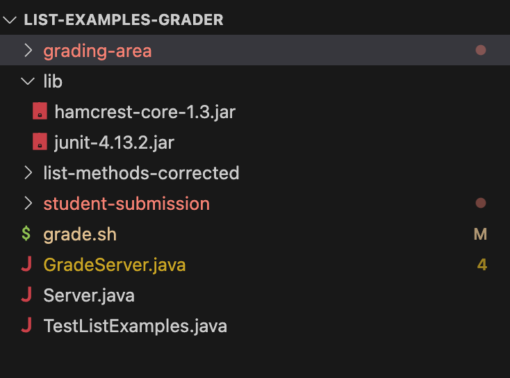
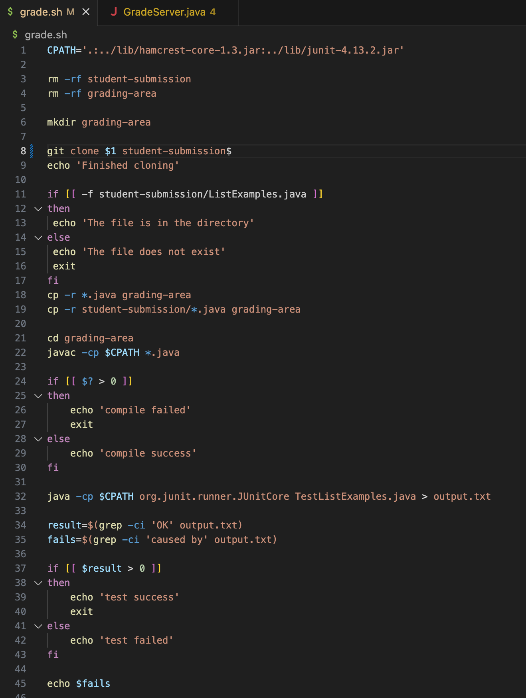
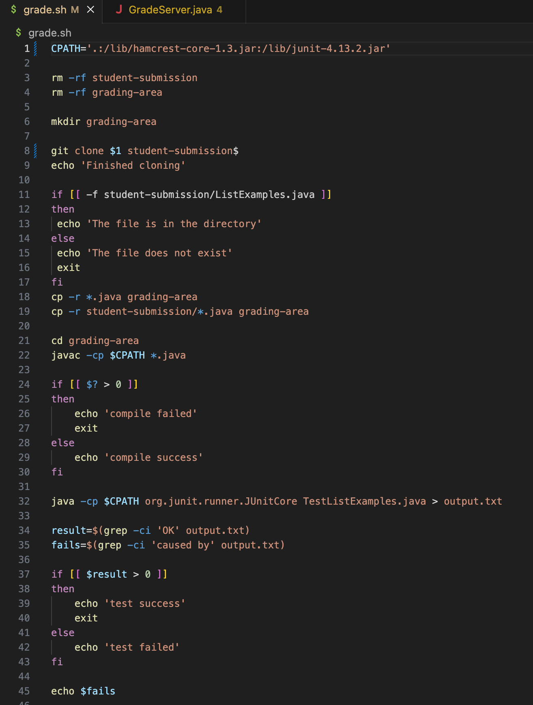

# Lab Report 5  
## ʕっ•ᴥ•ʔっ Part 1 – Debugging Scenario  
 
**1) Mock Student Post**  

  

 
 
For reference, here is a clearer version of the screenshot within the edstem post:  

  

 

**1) TA Mimick Response**  
> Consider what directory you are in and where the junit tests are. How would you access the lib folder with the path you are passing in your bash script? 
 

**2) Bug & Student's Terminal Output**  
The bash script correctly runs in the screenshot below. The bug was that the student's `CPATH` within their bash script did not have a proper relative path to the lib folder where the .jar files needed to run JUnit are. 
  

**3) Setup**  
> Directory Structure  

  

> File Structure (After fixing the bug)  

  

> File Structure (Before fixing the bug)  

  

> Command Triggering the Bug  

`sh grade.sh https://github.com/ucsd-cse15l-f22/list-methods-lab3`  

> To fix the bug  
 
In order to fix the bug, you will have to change the path given in `CPATH` and add ".." before lib to properly access the jar files within the lib folder.   

## ʕっ•ᴥ•ʔっ Part 2 – Reflection  
 
The most interesting thing I learned this second half of the quarter would have to be the vim command and being able to access as well as edit files within the terminal. Personally, this is what piqued my interest because it was a whole new way to write code and at that point I thought the terminal could only compile files--not expecting you could edit withi it. Another thing I would like to aknowledge would be the ouotput redirection. I just think its cool that there is a convenient way to save an output after compiling!

