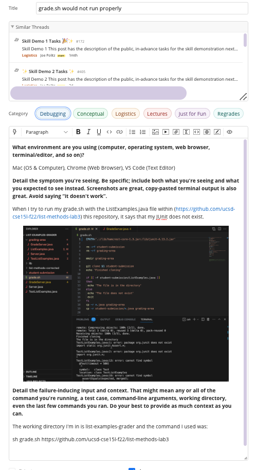
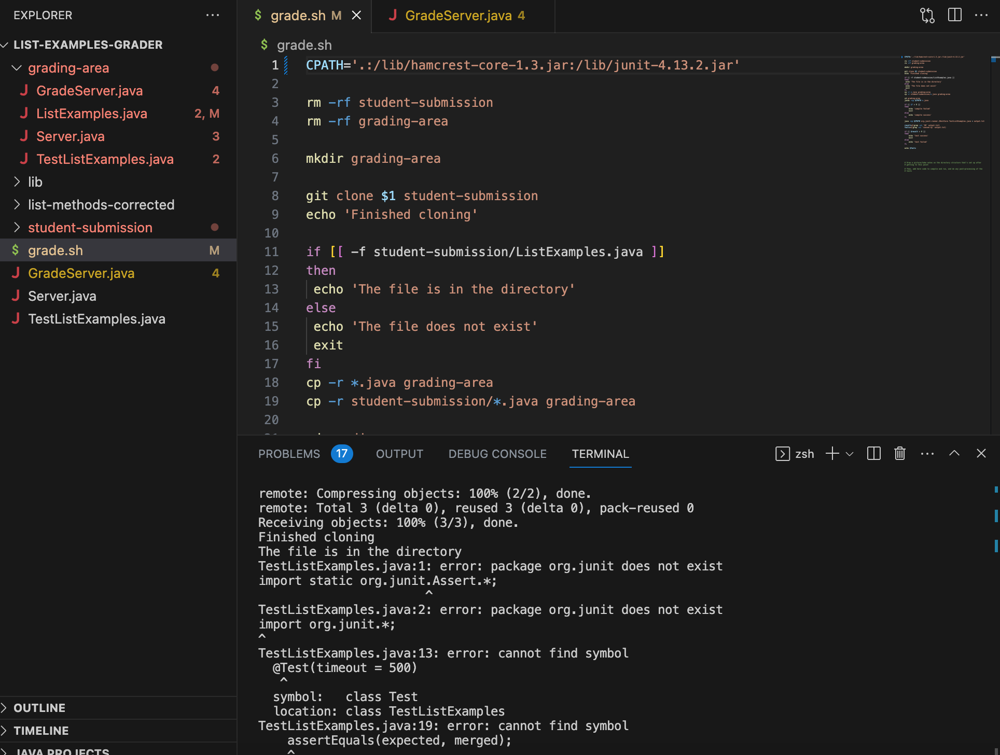
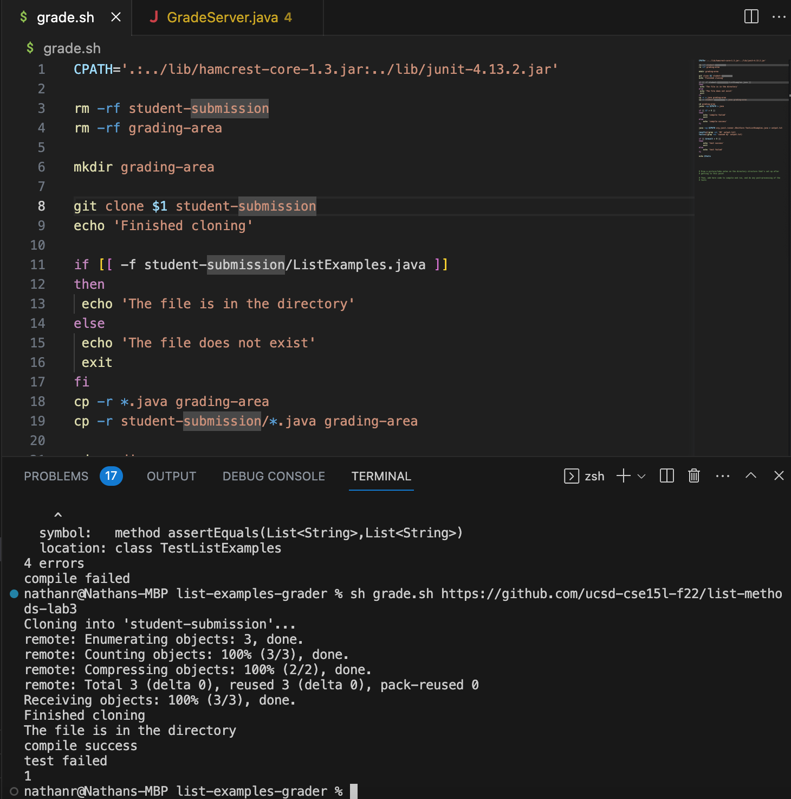

# Lab Report 5  
## ʕっ•ᴥ•ʔっ Part 1 – Debugging Scenario     
---
**1) Mock Student Post**  
  
 
For reference, here is a clearer version of the screenshot within the edstem post:  
  

**1) TA Mimick Response**  
> Consider what directory you are in and where the junit tests are. How would you access the lib folder with the path you are passing in your bash script? 
 

**2) Bug & Student's Terminal Output**  
The bash script correctly runs in the screenshot below. The bug was that the student's `CPATH` within their bash script did not have a proper relative path to the lib folder where the .jar files needed to run JUnit are. 
  

**3) Setup**  

